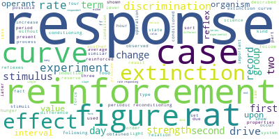
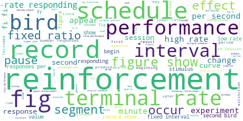
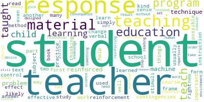
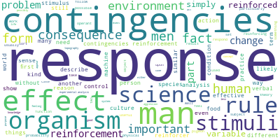
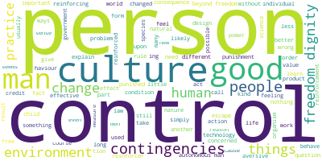
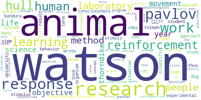

# Psychology and NLP
This is a project to analyse NLP on Behaviorist texts

## About Skinner
[B.F. Skinner](https://en.wikipedia.org/wiki/B._F._Skinner) (March 20, 1904 – August 18, 1990) was an American psychologist, behaviorist, author, inventor, and social philosopher. He was a professor of psychology at Harvard University from 1958 until his retirement in 1974.
Skinner was a prolific author, having published 21 books and 180 articles.

This is an analysis of his books to learn NLP better

# Word cloud
## By Skinner
### Behavior of Organisms 1938

### Science and Human Behavior 1953

### Schedules of Reinforcement 1957

### The Technology of Teaching 1968

### Contingencies of Reinforcement 1969

### About Behaviorism 1974

### Beyond Freedom and Dignity 1971

## Not from Skinner

### Understanding Behaviorism - William Baum

### A History of Modern Psychology - Shultz and Shultz chapters 8, 9, 10

